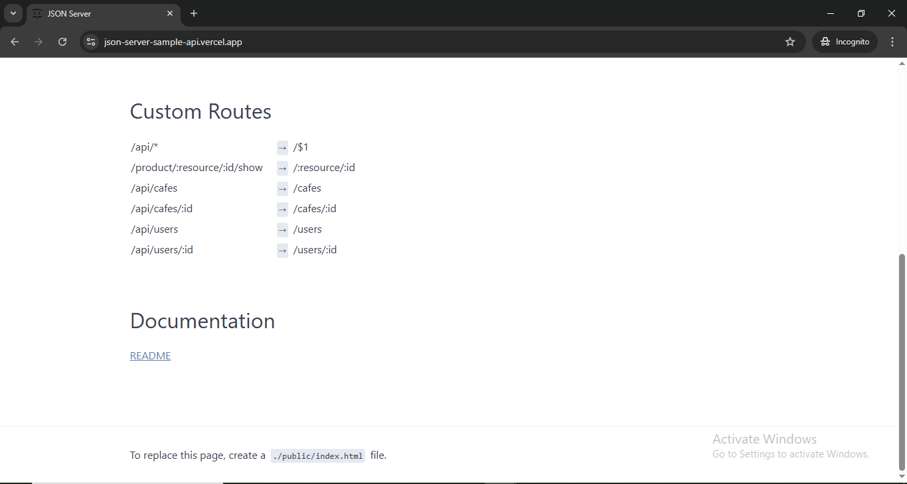

<h1 align="center">🚀 JSON-Server Demo</h1>

JSON Server hosted on **Vercel**. It's a read-only server with dummy data and doesn't support modifications.

---

## 🛠️ Installation & Running

### ⚙️ Backend (JSON Server)

```bash
    npm install json-server
```
```bash
    json-server --watch db.json  # For local development
```
```bash
    json-server --watch db.json --port 3000  # For production
```

---

### 🖼️ UI Sneak Peek

<p align="center">
  
</p>

<p align="center">
  *Screenshot of Server Running in Backend.*
</p>

<p align="center">
  
</p>

<p align="center">
  *Screenshot of Resulting Screen-1.*
</p>

<p align="center">
  
</p>

<p align="center">
  *Screenshot of Resulting Screen-2.*
</p>

---

## 🤝 Contributing

Thank you for your interest in contributing to this project!  
I welcome contributions from the community.

- You are free to use, modify, and redistribute this code under the terms of the MIT License.
- If you'd like to contribute, please **open an issue** or **submit a pull request**.
- All contributions will be reviewed and approved by the author — **Deepanshu Bajaj**.

---

## 📃 License

This project is licensed under the [MIT License](./LICENSE).  
You are free to use this project for personal, educational, or commercial purposes — just make sure to provide proper attribution.

> **Clarification:** Commercial use includes, but is not limited to, use in products,  
> services, or activities intended to generate revenue, directly or indirectly.